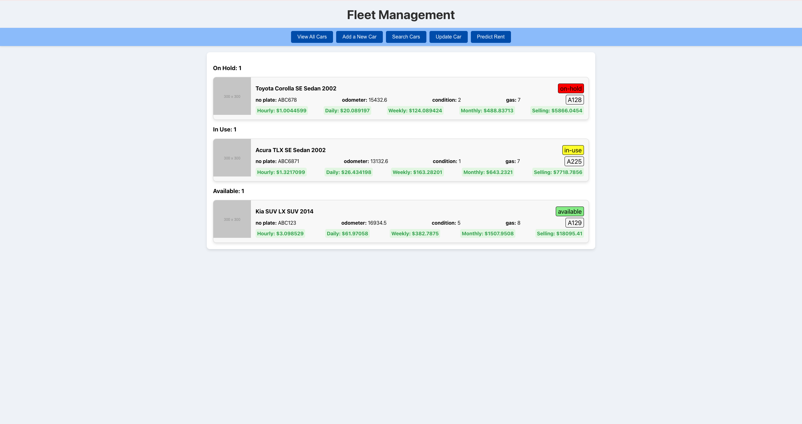
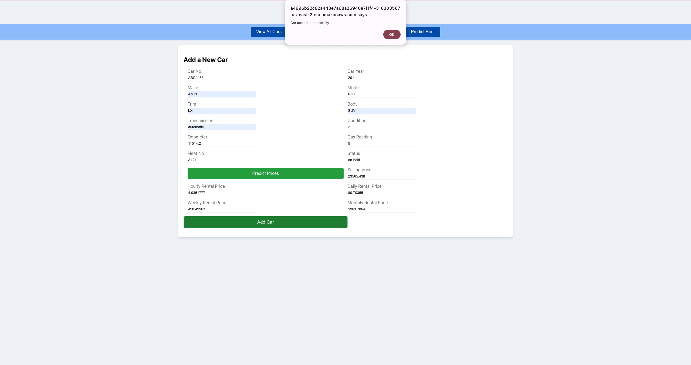
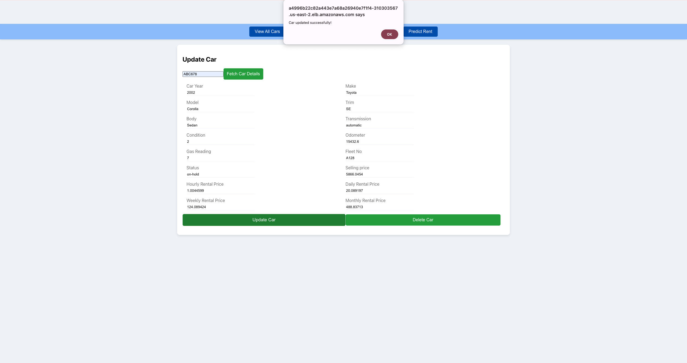
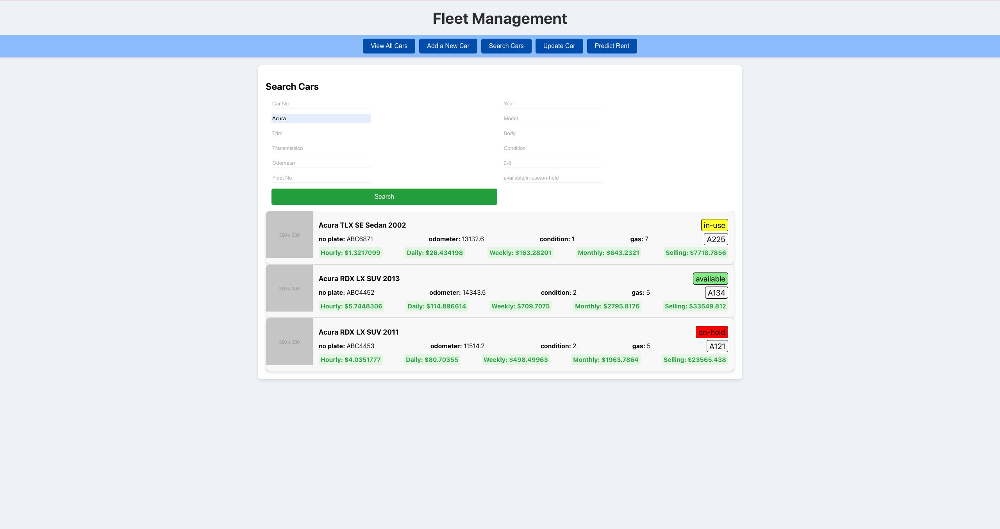

# Rateshop Frontend

This repository is part of the **Car Rental Front Office Operations** application, which consists of the following components:

- [**CarRentalPricingPrediction**](https://github.com/mj301296/CarRentalPricingPrediction): A Python package for predicting car rental prices.
- [**CarRentalPredictionApi**](https://github.com/mj301296/CarRentalPredictionApi): A FastAPI microservice that provides car rental price predictions.
- [**Rateshop Backend**](https://github.com/mj301296/RateShop): A Spring Boot application that handles car fleet management.
- [**Rateshop Frontend**](https://github.com/mj301296/rateshop-frontend): A React application offering an interactive user interface for managing car fleet operations.

## Rateshop Frontend

This is the **React** frontend of the Car Rental application, providing the user interface to interact with the car fleet system. Users can:

- View a list of cars
- Add a new car
- Update existing car details
- Delete a car
- Search for cars
- Predict car rental prices

## Explanation of Files and Directories

- **`src/`**: Source code for the React frontend application.
  - **`App.js`**: The main component that renders the application, managing navigation between different features.
  - **`App.css`**: Global styles for the application.
  - **`index.js`**: Entry point for the React app, rendering the root component into the DOM.
  - **`components/`**: Contains the main components for the application.
    - **`AddCar.js`**: A form component that allows users to add a new car to the fleet.
    - **`CarCard.js`**: A component that displays the details of a single car.
    - **`CarList.js`**: Displays a list of cars available in the fleet.
    - **`PredictRent.js`**: Provides an interface for users to input car details and predict rental prices.
    - **`SearchCars.js`**: A search bar for filtering cars by various attributes.
    - **`Tabs.js`**: A navigation component for switching between different functionalities (add, search, predict, etc.).
    - **`UpdateCar.js`**: A form for updating car details.
  - **`services/`**: Contains services for making API calls to the backend.
    - **`carService.js`**: Handles all interactions with the backend API, such as fetching car data, adding new cars, and predicting rent.
- **`rateshop-frontend-deployment.yaml`**: Kubernetes deployment file for deploying the React app to a cluster.
- **`package.json`**: Lists dependencies and scripts for running the application.

## Screenshots

### View all cars


### Add Car


### Update Car


### Search Cars


## Installation

1. Install dependencies:

    ```bash
    npm install
    ```

2. Start the development server:

    ```bash
    npm start
    ```

    The application will be available at `http://localhost:3000`.

## Building for Production

1. Build the project:

    ```bash
    npm run build
    ```

    This will generate a `build/` folder containing the production-ready files.

## Steps to Run the App via Docker

1. Build the Docker image:

    ```bash
    docker build -t rateshop-frontend .
    ```

2. Run the application in a Docker container:

    ```bash
    docker run -p 3000:3000 rateshop-frontend
    ```

    The application will be accessible at `http://localhost:3000`.

## Technologies Used

- **React**: A JavaScript library for building user interfaces.
- **Axios**: For making HTTP requests to the backend API.
- **CSS**: For styling the components and the overall layout.
- **Docker**: Containerization of the frontend application for consistent and scalable deployment.
- **Kubernetes**: For deploying and managing the application in a cloud environment.

## Cloud Deployment

### Technologies Used

- **Amazon EKS**: managed Kubernetes cluster.
- **Amazon RDS**: for PostgresSQL.
- **Amazon S3 Bucket**: For storing rent-predictor package.
- **Amazon ECR**: for storing docker images.

### Files needed

- **rateshop-backend-deployment.yaml**: configuration for Spring boot backend.
- **rateshop-frontend-deployment.yaml**: configuration for React frontend.
- **rent-predictor.yaml**: configuration for FastApi app.
- **configMap.yaml**: configuration of the URLs for communication between services.
- **secret.yaml**: secrets like AWS credentials, S3 bucket path, DB credentials.

1. Tag and Push docker images to ECR:

    ```bash
    docker tag <docker-image>:latest <amazonecs-url>/<docker-image>:latest
    docker push <amazonecs-url>/<docker-image>:latest
    ```

2. Create cluster using ekctbl:

    ```bash
    eksctl create cluster \
    --name car-rental \
    --version 1.25 \
    --region us-east-2 \
    --nodegroup-name linux-nodes \
    --node-type t3.micro \
    --nodes 3 \
    --nodes-min 1 \
    --nodes-max 4 \
    --managed
    ```

3. Apply configurations:

    ```bash
    kubectl apply -f rateshop-backend-deployment.yaml -f rateshop-frontend-deployment.yaml -f rent-predictor.yaml -f configMap.yaml -f secret.yaml
    ```
4. Check deployments/services/replicaSet/pods:

    ```bash
    kubectl get deployments/svc/rs/pods
    ```
5. Get Loadbalancers external IP for frontend and backend service:
    - The frontend and the backend are exposed outside of cluster using Load Balancers.
    - To make sure only requests from front-end are being accepted, CORS configuration is set-up in Spring app.
    - So, the backend needs to be provided with the frontend's LoadBalancer external-IP so that it could allow requests.
    - Similarly, the front-end also needs the back-end's LoadBalancer external-IP to route requests.

    ```bash
    kubectl get svc
    ```

6. Update IP's in configMap and apply:
   
    ```bash
    kubectl apply -f configMap.yaml
    ```

7. Restart deployment if necessary:

    ```bash
    kubectl rollout restart deployment rateshop-backend-deployment
    kubectl rollout restart deployment rateshop-frontend-deployment
    ```
8. Check logs if necessary:

    ```bash
    kubectl logs <pod-name>
    ```
9. Access the app via externalIP of rateshop-frontend-service
